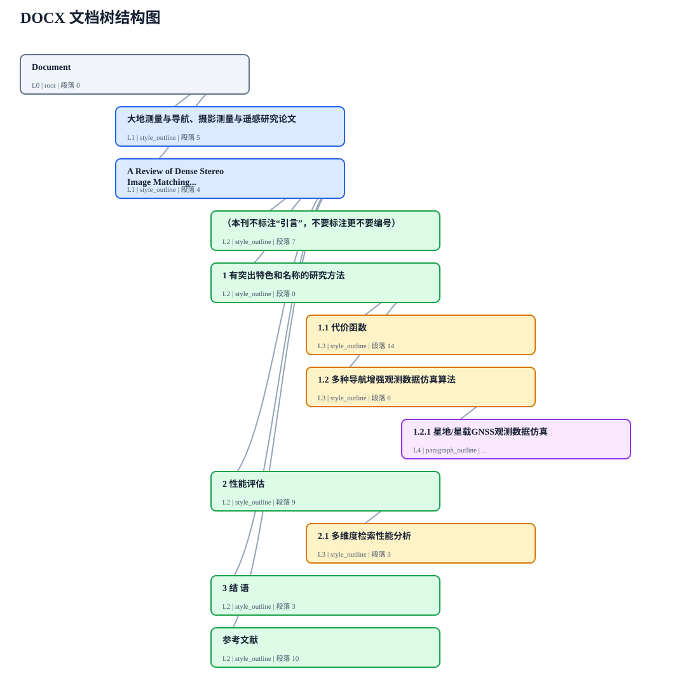

# DOCX Style Tree

[](https://github.com/lliqa/whuopensourcelab/actions/workflows/ci.yml)


武汉大学“开源软件与技术”课程项目。项目面向 `.docx` 文件，提供文档结构提取、结构样式替换和可视化演示报告能力。

作者：lc, syg  
课程：武汉大学开源软件与技术课程 2026  
许可证：MIT License

## 项目定位

`DOCX Style Tree` 将 Word 文档抽象为一棵类似 AST 的文档结构树。它不依赖 Microsoft Word 或 LibreOffice，而是直接读取 DOCX 包内部的 Office Open XML 部件，解析标题、段落、表格和样式信息。

核心能力：

- 提取 DOCX 中的标题层级、段落和表格，生成结构化 JSON。
- 根据样式、`outlineLvl` 和样式继承关系识别标题，而不是依赖正文关键词匹配。
- 提供 FastAPI v1 对外接口，适合作为独立文档处理服务集成。
- 支持按结构角色批量替换 Word 样式。
- 支持复杂 DOCX fixture、真实论文模板和自动化测试。
- 生成可截图用于演示的结构树 HTML/SVG 报告。

## 快速开始

建议使用 Python 3.11 和 `uv`。

```bash
uv python install 3.11
uv sync --extra dev
```

启动服务：

```bash
uv run uvicorn app.main:app --host 0.0.0.0 --port 8000 --reload
```

启动后访问：

- API 文档：http://127.0.0.1:8000/docs
- 健康检查：http://127.0.0.1:8000/health
- 服务能力：http://127.0.0.1:8000/api/v1/capabilities

## API 设计

### 获取服务能力

```bash
curl "http://127.0.0.1:8000/api/v1/capabilities"
```

该接口返回服务版本、能力列表、上传限制和算法说明，方便前端或其他系统做能力探测。

### 提取文档结构

```bash
curl -X POST "http://127.0.0.1:8000/api/v1/analyze" \
  -F "file=@example.docx"
```

核心返回字段：

```json
{
  "api_version": "1.0",
  "format": "docx",
  "algorithm": {
    "name": "ooxml_structure_tree",
    "uses_text_matching": false
  },
  "metadata": {
    "paragraph_count": 157,
    "table_count": 2,
    "heading_count": 11
  },
  "tree": {
    "title": "Document",
    "node_type": "document",
    "children": []
  }
}
```

标题节点会携带 `detect_reason`，用于说明识别依据：

| 值 | 含义 |
|---|---|
| `paragraph_outline` | 段落自身带有 `w:outlineLvl`。 |
| `style_outline` | 段落样式或其继承样式定义了 `outlineLvl`。 |
| `style_id` | 样式 ID 表明它是标题样式。 |
| `style_name` | 样式显示名称表明它是标题样式。 |
| `title_style` | 样式为标题页或题名样式。 |

### 替换结构样式

```bash
curl -X POST "http://127.0.0.1:8000/api/v1/styles/apply" \
  -F "file=@example.docx" \
  --output styled.docx
```

提交自定义样式映射：

```bash
curl -X POST "http://127.0.0.1:8000/api/v1/styles/apply" \
  -F "file=@example.docx" \
  -F 'style_map={"heading_1":"Heading 1","heading_2":"Heading 2","normal":"Normal"}' \
  --output styled.docx
```

兼容接口 `/api/tree` 和 `/api/style` 仍然保留，推荐新代码使用 `/api/v1`。

## 命令行使用

提取文档树：

```bash
uv run python cli.py analyze example.docx -o tree.json
```

替换文档样式：

```bash
uv run python cli.py style example.docx -o styled.docx
```

指定样式配置：

```bash
uv run python cli.py style example.docx \
  -o styled.docx \
  --styles config/predefined_styles.json
```

## 解析思路

DOCX 文件本质上是一个 ZIP 包，正文和样式分别存储在 XML 部件中。本项目的核心不是 KMP 字符串匹配，而是基于 OOXML 的结构化解析。

处理流程：

```text
.docx
  -> 解包 ZIP
  -> 读取 word/document.xml
  -> 读取 word/styles.xml
  -> 建立样式 ID、样式名、outlineLvl、basedOn 继承索引
  -> 遍历正文段落和表格
  -> 判断标题层级
  -> 使用栈构建文档结构树
```

建树伪代码：

```python
for block in document_body:
    if block is heading(level):
        while stack[-1].level >= level:
            stack.pop()
        stack[-1].children.append(block)
        stack.append(block)
    else:
        stack[-1].content.append(block)
```

相比正文关键词规则，这种方式更适合真实 Word 文档，因为它利用的是文档内部的结构和样式元数据。普通段落、题目编号、习题编号不会因为文本长得像标题而被误判为章节。

## 可视化报告

示例可视化结果如下，来源于仓库内的真实论文模板 fixture：



生成结构提取结果的 HTML/SVG 报告：

```bash
make report
```

默认输入为仓库内的论文模板 fixture：

```text
tests/fixtures/geodesy_navigation_remote_sensing_thesis_template.docx
```

输出目录：

```text
outputs/extraction-report/
├── index.html   # 结构树结果页面
├── tree.svg     # 文档树结构图
└── tree.json    # 原始 API 风格 JSON
```

指定自己的 DOCX：

```bash
make report REPORT_DOCX="/path/to/thesis-template.docx"
```

## 测试与质量

运行完整检查：

```bash
make check
```

检查内容：

- `ruff` 静态检查。
- `mypy` 类型检查。
- `unittest` 单元测试。
- `coverage` 覆盖率检查。
- `coverage html` 生成覆盖率网页。

当前本地结果：

```text
47 tests passed
coverage: 92%
```

运行外部复杂 DOCX fixture 测试：

```bash
make fixtures
make check
```

fixture 清单位于 `tests/fixtures/docx_manifest.json`，仓库只保存来源 URL 与 SHA256，不提交外部二进制文件。

生成 Doxygen API 文档：

```bash
make docs
```

该命令需要本机已安装 `doxygen`，输出位于 `docs/api/html/index.html`。

## 项目结构

```text
.
├── app/                         # FastAPI 服务入口与上传校验
├── config/                      # 预定义样式映射
├── docs/                        # 课程文档、README 图片与生成的 API 文档
├── docx_style_tree/             # 核心 DOCX 解析与样式替换模块
│   ├── extractor.py             # 文档树提取
│   ├── ooxml.py                 # OOXML 通用工具与块遍历
│   ├── package.py               # DOCX 包读取与 XML 解析
│   ├── style_replacer.py        # 结构样式替换
│   └── models.py                # 文档树数据模型
├── scripts/                     # fixture 下载与报告生成脚本
├── tests/                       # 单元测试和复杂 DOCX fixture 测试
├── cli.py                       # 命令行入口
├── Makefile                     # 常用开发命令
└── pyproject.toml               # 项目元数据与工具配置
```

## 小组分工

| 成员 | 主要负责内容 |
|---|---|
| lc | FastAPI 服务封装、上传校验、API v1 抽象、命令行入口、工程化配置与质量检查。 |
| syg | OOXML 文档结构解析、标题识别逻辑、样式替换、复杂 DOCX 测试、可视化报告生成。 |

## 仓库地址

https://github.com/lliqa/whuopensourcelab
