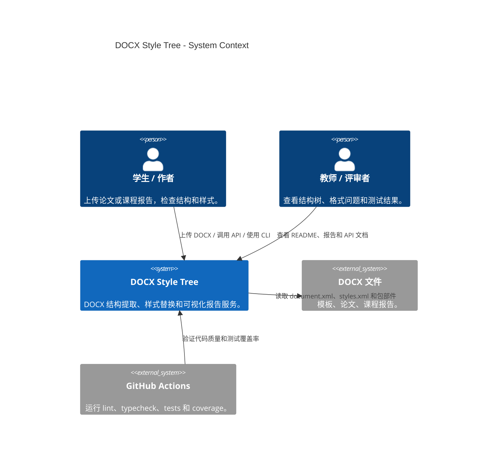
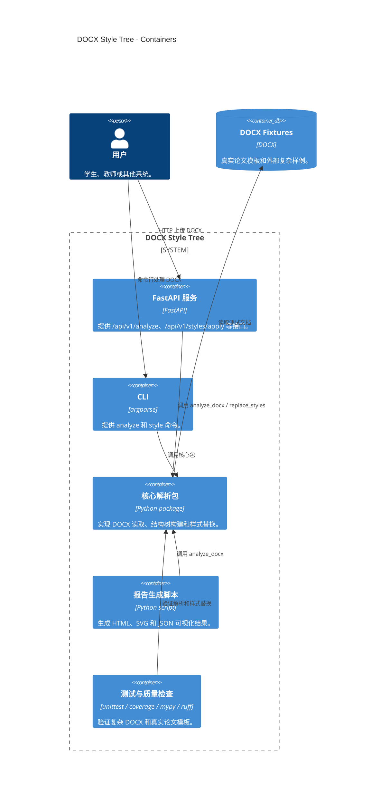
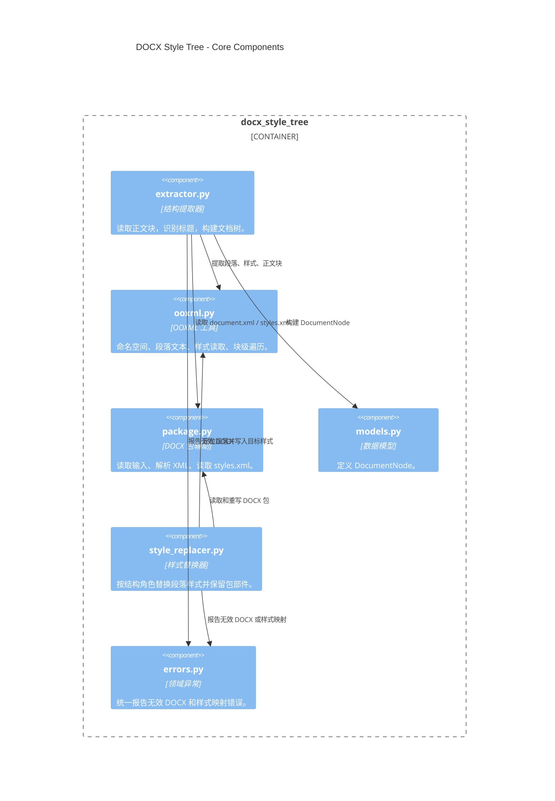
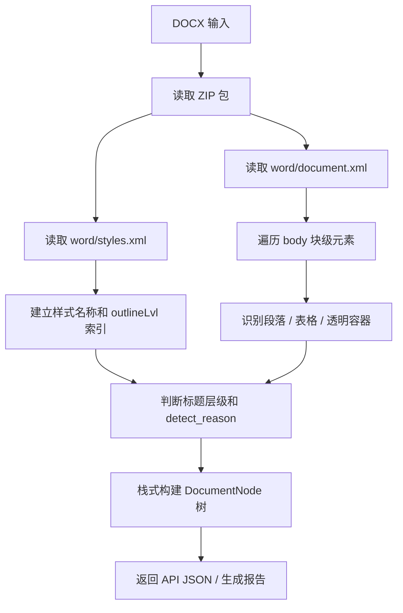
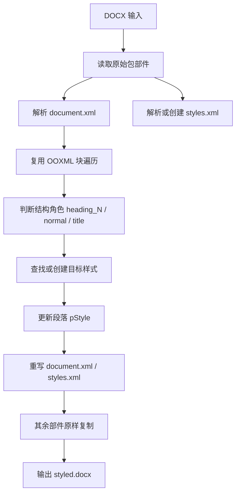
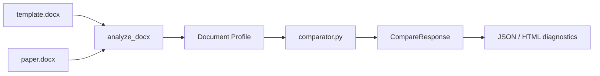

# 架构设计

本文档说明 `DOCX Style Tree` 的架构风格、组件划分、关键流程、敏感点和 ATAM 分析。它的目标不是展示代码细节，而是解释为什么当前架构适合“DOCX 文档结构提取与样式规范化”这个课程项目。

## 架构目标

项目的核心目标是把 `.docx` 文件变成可编程、可检查、可展示的结构化数据，同时保持部署简单、测试可复现、接口清晰。

设计约束：

- 运行环境以 Linux + Python + FastAPI 为主。
- 不依赖 Microsoft Word 或 LibreOffice。
- 解析过程应基于 Office Open XML，而不是正文关键词匹配。
- 对外能力需要能通过 HTTP API、CLI 和演示报告复用。
- 复杂 DOCX 包中的非目标部件应尽量原样保留。

## 架构风格

当前系统采用 **轻量分层架构 + Ports and Adapters 思路**。

```text
接口层        FastAPI / CLI / 报告脚本
应用层        上传校验、参数解析、输出格式组织
核心层        DOCX 解析、结构树构建、样式替换
基础设施层    ZIP 包读取、XML 解析、测试 fixtures、生成报告
```

这种架构的好处：

- FastAPI、CLI、报告脚本只是入口，核心能力集中在 `docx_style_tree` 包中。
- 核心逻辑基本无状态，不依赖数据库，容易测试和复用。
- 后续增加 `/api/v1/compare` 时，可以复用现有解析器和样式元数据读取能力。
- 解析输出与展示报告分离，避免把演示话术混入真实 API 输出。

## C4 Context



## C4 Container



## C4 Component



## 关键运行流程

### 文档结构提取



### 样式替换



## 关键设计决策

| 决策 | 原因 | 代价 |
|---|---|---|
| 直接解析 OOXML，而不是依赖 Word。 | Linux 服务端可运行，部署简单，适合课程要求。 | 无法获得 Word 渲染后的精确版面。 |
| 禁止正文关键词匹配标题。 | 避免“第一章”“1.1”等普通正文被误判。 | 需要依赖文档内部样式质量。 |
| 使用 `detect_reason` 暴露识别依据。 | 结果可解释，适合演示和调试。 | 输出结构略复杂。 |
| API、CLI、报告脚本共用核心包。 | 降低重复逻辑，方便测试。 | 核心包需要保持接口稳定。 |
| 保留旧 `/api/tree` 和 `/api/style`。 | 向后兼容。 | API 文档中需要解释推荐使用 `/api/v1`。 |
| 复杂部件默认保留。 | 避免损坏 DOCX 包中的图片、脚注、页眉页脚等。 | 样式替换逻辑必须谨慎选择修改范围。 |

## 质量属性

| 质量属性 | 当前设计如何支持 |
|---|---|
| 可移植性 | 基于 Python 标准库 ZIP/XML 和 FastAPI，不依赖桌面 Office。 |
| 可测试性 | 核心逻辑是无状态函数，单元测试可直接传入 DOCX bytes。 |
| 可解释性 | 标题节点包含 `detect_reason`、样式 ID 和样式名称。 |
| 可维护性 | API/CLI/report 与核心解析包分离。 |
| 兼容性 | 支持真实论文模板和外部复杂 DOCX fixtures。 |
| 安全性 | FastAPI 上传入口限制文件扩展、压缩体积和成员路径。 |
| 可演示性 | README、SVG 图、HTML 报告和 coverage 报告可直接截图。 |

## 敏感点

以下因素对架构和质量影响较大：

1. **DOCX 变体复杂度**
   - Word、LibreOffice、WPS 生成的 OOXML 可能差异很大。
   - 当前通过真实论文模板和外部 fixture 降低风险。

2. **样式质量**
   - 如果文档没有使用结构化标题样式，解析器不会仅凭正文文本猜标题。
   - 这是有意取舍：牺牲部分“猜测能力”，换取可解释性和稳定性。

3. **包部件保留**
   - 样式替换时只应修改必要 XML 部件，其他部件需要原样复制。
   - 这是 DOCX 不损坏的关键。

4. **上传安全**
   - ZIP 包可能包含路径穿越、超大解压体积等风险。
   - API 层需要持续维护输入限制。

5. **API 输出稳定**
   - 后续增加比较功能时，应保持 `api_version` 和 v1 schema 兼容。

## ATAM 分析

ATAM 关注“架构决策如何影响质量属性”。本项目的简化 ATAM 分析如下。

### 业务驱动力

- 课程项目需要体现开源软件工程方法，而不只是代码实现。
- 用户需要快速理解 DOCX 文档结构，并能统一样式。
- 服务应能在 Linux 环境运行，便于部署和演示。
- 输出需要可解释、可复现、可测试。

### 质量属性场景

| 场景 | 刺激 | 响应 | 度量 |
|---|---|---|---|
| 复杂 DOCX 输入 | 上传含内容控件、表格、脚注的论文模板 | 服务返回结构树且不崩溃 | 单元测试通过，复杂部件保留 |
| 样式替换 | 用户提交目标样式映射 | 只替换结构段落样式 | 输出 DOCX 可解析，非目标部件一致 |
| 误判控制 | 正文包含“第一章”“1.1” | 不因正文文本将其识别为标题 | 测试覆盖 unstyled heading-like text |
| API 集成 | 第三方系统调用 `/api/v1/analyze` | 返回稳定 JSON schema | `api_version` 和元数据字段存在 |
| 演示复现 | 教师运行 `make report` | 生成 HTML/SVG/JSON 报告 | 输出文件存在且内容可读 |

### 架构风险

| 风险 | 影响 | 缓解 |
|---|---|---|
| 文档没有规范使用样式 | 标题识别结果不完整 | 在报告中暴露 `detect_reason`，后续提供诊断提示。 |
| OOXML 容器类型持续增加 | 部分块可能未被遍历 | 将块遍历集中在 `ooxml.py`，新增容器只改一处。 |
| 样式替换误改目录或列表 | 破坏文档显示 | 跳过 TOC 域、跳过列表段落，测试覆盖。 |
| API 结果不断扩展 | 客户端兼容性下降 | 使用 `/api/v1` 版本化，新增字段保持向后兼容。 |

### 非风险

| 非风险 | 原因 |
|---|---|
| 无数据库状态 | 服务主要是文件输入输出，暂不需要持久化。 |
| 无异步后台任务 | 当前文件规模受上传限制控制，单次请求足够。 |
| 无完整排版渲染 | 项目目标是结构与样式检查，不是复刻 Word 渲染。 |

### 权衡点

| 权衡 | 选择 |
|---|---|
| 猜测更多标题 vs 降低误判 | 选择降低误判，不使用正文文本规则。 |
| 引入大型 DOCX 库 vs 保持可控依赖 | 选择标准库 ZIP/XML，便于解释和部署。 |
| 输出简单 JSON vs 输出可解释诊断 | 选择带诊断信息的 JSON，便于演示和调试。 |
| 单一入口 vs 多入口 | 保留 API、CLI、报告脚本，但共用核心包。 |

## 后续架构演进

后续比较模板和实际论文时，可以在当前架构上增加一个 `comparator.py` 模块：



该扩展仍然复用现有核心包，不需要引入数据库或复杂任务系统，符合项目范围。
